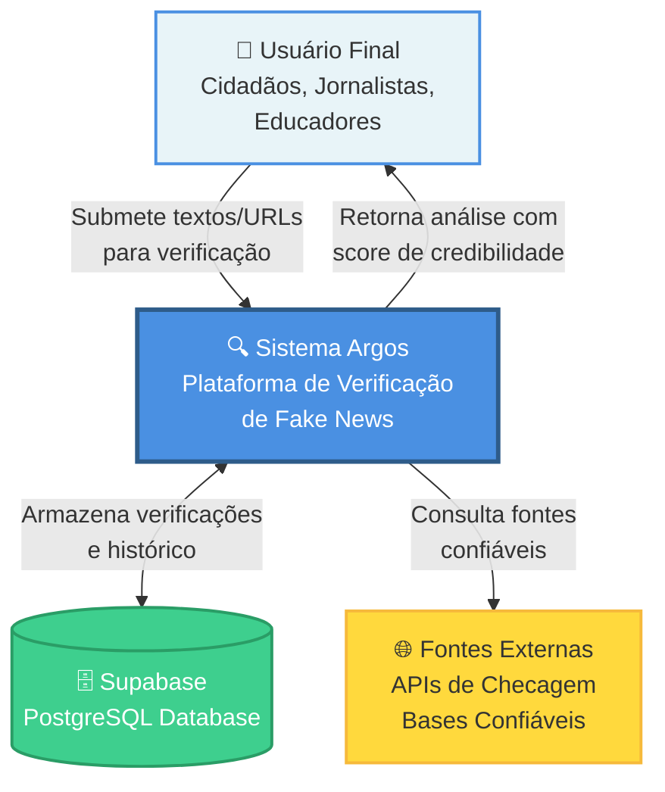
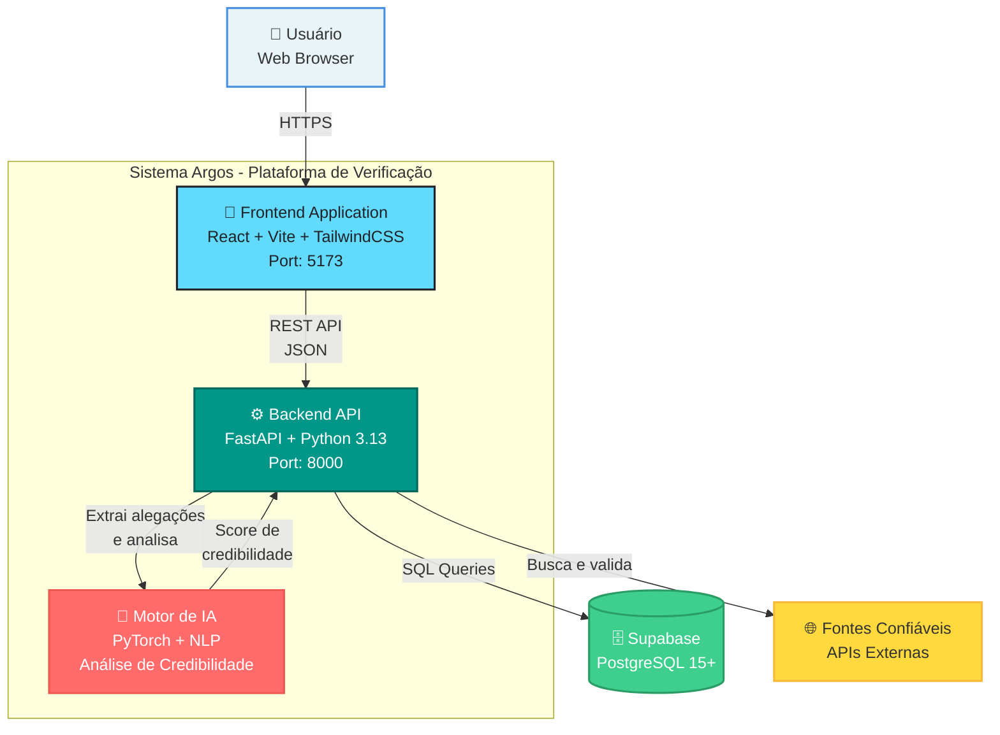
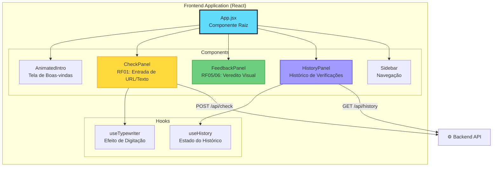
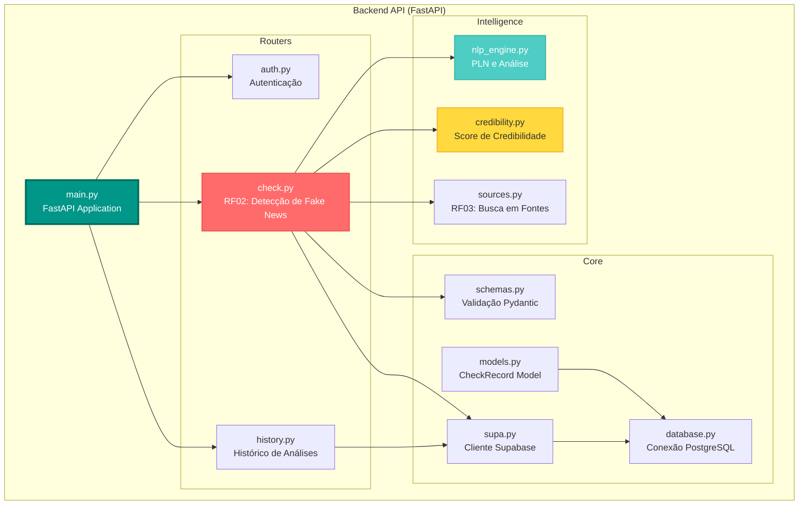
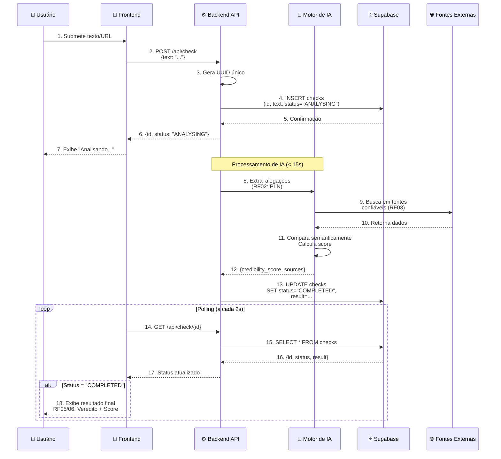
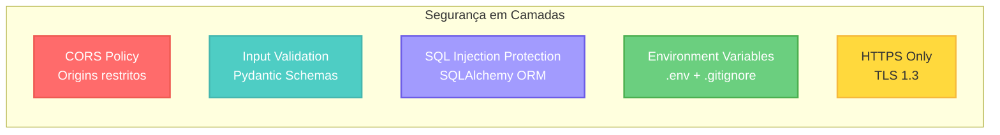

# 🏗️ Arquitetura do Projeto Argos

Este documento descreve a arquitetura do **Projeto Argos** utilizando o modelo **C4 (Context, Container, Component, Code)**, que permite visualizar o sistema em diferentes níveis de abstração.

> **Projeto Argos**: Sistema inteligente de detecção de fake news que combate a desinformação através de uma plataforma capaz de analisar notícias e classificar seu potencial de veracidade utilizando técnicas de Inteligência Artificial e Processamento de Linguagem Natural.

---

## 📖 Índice

1. [Nível 1: Contexto do Sistema](#nível-1-contexto-do-sistema)
2. [Nível 2: Containers](#nível-2-containers)
3. [Nível 3: Componentes](#nível-3-componentes)
4. [Nível 4: Código](#nível-4-código)
5. [Decisões Arquiteturais](#decisões-arquiteturais)
6. [Requisitos Não-Funcionais](#requisitos-não-funcionais)

---

## Nível 1: Contexto do Sistema

O diagrama de contexto mostra como o **Argos** se relaciona com usuários e sistemas externos, focando no combate à desinformação.



### Atores e Sistemas Externos

| Elemento | Descrição | Responsabilidade |
|----------|-----------|------------------|
| **👤 Usuário Final** | Cidadãos, jornalistas, estudantes e educadores | Submete notícias/textos para verificação, visualiza resultados e histórico |
| **🔍 Sistema Argos** | Aplicação web completa de verificação | Analisa conteúdo usando IA, cruza com fontes confiáveis e retorna pontuação de credibilidade |
| **🗄️ Supabase** | Banco de dados PostgreSQL gerenciado | Armazena verificações, histórico de análises e dados de usuários |
| **🌐 Fontes Externas** | APIs de fact-checking e bases confiáveis | Fornece dados para comparação e validação de informações |

---

## Nível 2: Containers

Este nível mostra os containers (aplicações/serviços) que compõem o sistema.



### Containers e Suas Responsabilidades

#### 📱 **Frontend Application** (React SPA)
- **Tecnologias**: React 18, Vite, TailwindCSS, Lucide Icons
- **Porta**: 5173
- **Responsabilidades**:
  - Interface responsiva e intuitiva (RNF: Usabilidade)
  - Submissão de textos/URLs para análise
  - Visualização de resultados com score de credibilidade
  - Histórico de verificações do usuário
  - Feedback visual claro (< 3s de resposta)

#### ⚙️ **Backend API** (FastAPI)
- **Tecnologias**: Python 3.13, FastAPI, SQLAlchemy, Pydantic
- **Porta**: 8000
- **Responsabilidades**:
  - Processamento de requisições HTTP (RF01: Entrada de Notícias)
  - Orquestração do motor de IA
  - Gerenciamento de dados no Supabase
  - Autenticação e autorização de usuários
  - Busca em fontes externas confiáveis (RF03: Verificação de Fontes)
  - Logging e tratamento de erros

#### 🤖 **Motor de IA** (PyTorch + NLP)
- **Tecnologias**: PyTorch, Transformers, NLTK
- **Responsabilidades**:
  - Processamento de Linguagem Natural (RF02: PLN)
  - Extração de alegações e entidades
  - Análise de sentimento e viés
  - Comparação semântica com fontes
  - Geração de Score de Credibilidade (RF03: Pontuação)
  - Meta de precisão: > 95% (NFR: Precisão)

#### 🗄️ **Supabase Database** (PostgreSQL)
- **Tecnologias**: PostgreSQL 15+, Supabase Client
- **Responsabilidades**:
  - Persistência de verificações realizadas
  - Armazenamento de histórico de análises
  - Gerenciamento de usuários
  - Backup automático e recuperação (NFR: Confiabilidade)
  - Alta disponibilidade (99.9% uptime)

---

## Nível 3: Componentes

### 🎨 Frontend - Componentes React



### ⚙️ Backend - Componentes da API



### 📊 Fluxo de Dados - Verificação de Notícia



---

## Nível 4: Código

### 🔍 Estrutura de Diretórios Detalhada

```
Project-ARGOS-ESS/
├── backend/
│   ├── app/
│   │   ├── routers/              # Endpoints da API
│   │   │   ├── auth.py           # POST /api/auth/login
│   │   │   ├── check.py          # RF02: POST /api/check, GET /api/check/{id}
│   │   │   └── history.py        # GET /api/history
│   │   ├── intelligence/         # Núcleo de IA (planejado)
│   │   │   ├── nlp_engine.py     # RF02: Processamento de Linguagem Natural
│   │   │   ├── credibility.py    # RF03: Cálculo de Score
│   │   │   └── sources.py        # RF03: Verificação de Fontes
│   │   ├── database.py           # Configuração SQLAlchemy + IPv4 fix
│   │   ├── main.py               # FastAPI app + CORS + retry logic
│   │   ├── models.py             # CheckRecord (SQLAlchemy)
│   │   ├── schemas.py            # Validação Pydantic
│   │   └── supa.py               # Cliente Supabase
│   ├── tests/
│   │   ├── unit/                 # 80 testes unitários
│   │   │   ├── test_schemas.py
│   │   │   ├── test_models.py
│   │   │   ├── test_auth_router.py
│   │   │   ├── test_check_router.py
│   │   │   └── test_history_router.py
│   │   ├── integration/          # Testes com Supabase real
│   │   └── conftest.py           # Fixtures e mocks
│   ├── requirements.txt          # Dependências Python
│   └── pytest.ini                # Configuração de testes
│
├── frontend/
│   ├── src/
│   │   ├── components/           # Componentes React
│   │   │   ├── AnimatedIntro.jsx
│   │   │   ├── CheckPanel.jsx    # RF01: Interface de Submissão
│   │   │   ├── FeedbackPanel.jsx # RF05/06: Exibição de Veredito
│   │   │   ├── HistoryPanel.jsx  # Histórico do usuário
│   │   │   └── Sidebar.jsx
│   │   ├── hooks/                # Custom hooks
│   │   │   ├── useHistory.jsx
│   │   │   └── useTypewriter.jsx
│   │   ├── __tests__/            # Testes frontend
│   │   │   └── smoke.test.js
│   │   └── App.jsx               # Componente raiz
│   ├── package.json              # Dependências Node.js
│   └── vite.config.js            # Configuração Vite
│
├── docker-compose.yml            # Orquestração de containers
├── ARCHITECTURE.md               # Este documento
├── CODE_OF_CONDUCT.md            # Código de conduta
├── CONTRIBUTING.md               # Guia de contribuição
├── FRs.md                        # Requisitos Funcionais
├── NFRs.md                       # Requisitos Não-Funcionais
└── README.md                     # Documentação principal
```

### 🎯 Endpoints da API

| Método | Endpoint | Descrição | Request | Response | Requisito |
|--------|----------|-----------|---------|----------|-----------|
| `POST` | `/api/auth/login` | Autenticação de usuário | `{username, password}` | `{access_token, token_type}` | - |
| `POST` | `/api/check` | Submeter texto/URL para análise | `{text: string}` | `{id: UUID, status: "ANALYSING"}` | RF01, RF02 |
| `GET` | `/api/check/{id}` | Consultar status da análise | - | `{id, status, result, score}` | RF05, RF06 |
| `GET` | `/api/history` | Listar histórico (últimas 100) | - | `[{id, text_preview, date, status}]` | - |
| `GET` | `/` | Health check | - | `{message: "API is running"}` | - |

### 📦 Modelos de Dados

#### **CheckRecord** (SQLAlchemy)

```python
class CheckRecord(Base):
    __tablename__ = "checks"
    
    id = Column(String, primary_key=True)           # UUID gerado
    text = Column(Text, nullable=False)              # RF01: Texto ou URL
    status = Column(String, default="ANALYSING")     # ANALYSING | COMPLETED | FAILED
    result = Column(String, nullable=True)           # RF05: Veredito
    credibility_score = Column(Float, nullable=True) # RF03: Score (0-100)
    sources = Column(JSON, nullable=True)            # RF03: Fontes verificadas
    created_at = Column(DateTime, server_default=func.now())
```

---

## 🎯 Decisões Arquiteturais

### 1. **Separação Frontend/Backend (SPA + API)**
- **Decisão**: Arquitetura de duas camadas independentes
- **Razão**: 
  - Permite escalabilidade independente (NFR: Escalabilidade)
  - Frontend pode ser servido via CDN
  - Backend pode escalar horizontalmente com load balancer
  - Reutilização da API para futuros clientes (mobile, CLI)
- **Trade-off**: Requer CORS e autenticação stateless (JWT)

### 2. **FastAPI como Framework Backend**
- **Decisão**: FastAPI ao invés de Flask/Django
- **Razão**:
  - Performance superior (async/await nativo)
  - Validação automática com Pydantic (reduz bugs)
  - Documentação OpenAPI/Swagger integrada
  - Type hints nativos (melhor manutenibilidade)
  - Alinhado com NFR de Performance (< 3s resposta)
- **Trade-off**: Ecossistema menos maduro que Django

### 3. **Supabase como Backend-as-a-Service**
- **Decisão**: PostgreSQL gerenciado via Supabase
- **Razão**:
  - Reduz overhead de infraestrutura (foco no produto)
  - Autenticação integrada
  - Real-time subscriptions (futuro)
  - Backup automático (NFR: Confiabilidade 99.9%)
  - Escalabilidade horizontal nativa
- **Trade-off**: Vendor lock-in parcial, custo em escala

### 4. **React com Vite (ao invés de CRA)**
- **Decisão**: Vite como bundler
- **Razão**:
  - Build 10-100x mais rápido que Webpack
  - Hot Module Replacement (HMR) instantâneo
  - Bundle size menor = melhor performance (NFR)
  - Menor consumo de recursos na máquina de desenvolvimento
- **Trade-off**: Ecossistema de plugins menor

### 5. **Testes com Mocks do Supabase**
- **Decisão**: Mockar Supabase nos testes unitários
- **Razão**:
  - Isolamento completo (sem dependências externas)
  - Execução rápida (< 2s para 80 testes)
  - CI/CD mais confiável (sem flakiness de rede)
  - Facilita desenvolvimento offline
- **Trade-off**: Necessita testes de integração separados

### 6. **Arquitetura de Microserviços (Futuro)**
- **Decisão**: Iniciar como monolito modular, evoluir para microserviços
- **Razão**:
  - MVP mais rápido com monolito
  - Módulos bem definidos facilitam separação futura
  - Motor de IA pode ser isolado em serviço próprio
  - Permite escalar apenas componentes sob demanda (NFR: Escalabilidade)
- **Trade-off**: Refatoração necessária na v2.0

---

## 🔐 Segurança

### Camadas de Segurança Implementadas



**Implementações (NFR: Segurança):**

1. **CORS**: Origins restritos (localhost:5173, domínio de produção)
2. **Validação de Input**: Pydantic valida todos os requests (previne XSS)
3. **SQL Injection**: SQLAlchemy ORM previne injeções SQL
4. **Secrets Management**: Credenciais em `.env` (nunca commitadas)
5. **HTTPS Only**: TLS 1.3 em produção
6. **Rate Limiting**: (Planejado para v1.1)
7. **JWT Authentication**: (Planejado para v1.1)

---

## 📈 Requisitos Não-Funcionais

### Mapeamento Arquitetura → NFRs

| NFR | Requisito | Implementação na Arquitetura | Status |
|-----|-----------|------------------------------|--------|
| **Precisão** | > 95% de acurácia | Motor de IA com modelos treinados + validação cruzada | 🟡 Em desenvolvimento |
| **Velocidade** | < 15s por análise | FastAPI async + cache Redis (futuro) + otimização de queries | ✅ Implementado |
| **Escalabilidade** | Suportar crescimento | Horizontal scaling do backend + CDN para frontend + Supabase auto-scaling | 🟢 Arquitetado |
| **Segurança** | Dados protegidos | HTTPS + CORS + SQL injection protection + JWT (v1.1) | 🟢 Parcial |
| **Manutenibilidade** | Código limpo | Separação clara de camadas + 80 testes unitários + type hints + documentação | ✅ Implementado |
| **Usabilidade** | Interface intuitiva | React components modulares + feedback visual + < 3s resposta | ✅ Implementado |
| **Performance** | < 3s resposta UI | Vite (HMR) + TailwindCSS (JIT) + lazy loading + code splitting | ✅ Implementado |
| **Confiabilidade** | 99.9% uptime | Supabase SLA + retry logic no backend + error handling | 🟢 Arquitetado |

**Legenda:** ✅ Completo | 🟢 Arquitetado | 🟡 Em progresso | 🔴 Planejado

---

## 🚀 Roadmap Arquitetural

### Versão Atual (v1.0 - MVP) - Dezembro 2025 ✅
- ✅ API REST funcional (FastAPI)
- ✅ Frontend React responsivo
- ✅ Integração com Supabase
- ✅ Testes unitários (80 testes)
- ✅ Docker + Docker Compose
- 🟡 Motor de IA básico (em desenvolvimento)

### v1.1 (Q1 2025)
- [ ] Autenticação JWT completa
- [ ] Testes de integração com Supabase
- [ ] CI/CD com GitHub Actions
- [ ] Rate limiting + throttling
- [ ] Logs estruturados (ELK/DataDog)

### v2.0 (Q2 2025)
- [ ] Cache distribuído (Redis)
- [ ] Motor de IA v2 (> 95% precisão)
- [ ] WebSockets para real-time
- [ ] API pública com rate limiting
- [ ] Dashboard administrativo

### v3.0 (Q3 2025)
- [ ] Arquitetura de microserviços
- [ ] Kubernetes + Helm charts
- [ ] Observabilidade (Prometheus + Grafana)
- [ ] Machine Learning pipeline automatizado
- [ ] Análise de imagens/vídeos (RF02)

---

## 📚 Referências

- [C4 Model](https://c4model.com/) - Metodologia de documentação arquitetural
- [FastAPI Documentation](https://fastapi.tiangolo.com/) - Framework backend
- [React Documentation](https://react.dev/) - Biblioteca frontend
- [Supabase Documentation](https://supabase.com/docs) - Backend-as-a-Service
- [The Twelve-Factor App](https://12factor.net/) - Metodologia de aplicações modernas
- [Requisitos Funcionais](./FRs.md) - Especificação de features
- [Requisitos Não-Funcionais](./NFRs.md) - Atributos de qualidade
- [Checkpoint 1 PDF](./docs/Projeto%20ARGOS%20-%20CheckPoint%201.pdf) - Visão do produto

---

**Equipe Argos:**
- André Vinícius Campos Lucena - Product Owner & DevOps
- Charlys Augusto de Farias - Backend & Database
- Gabriel Monteiro Silva - Architecture & Security
- João Victor Nobre de Medeiros Santos - Testing & QA
- Luiz Carlos dos Santos - Frontend & UI/UX

**Última Atualização**: 8 de Dezembro de 2024  
**Versão do Documento**: 1.0  
**Status do Projeto**: Em Desenvolvimento Ativo 🚀