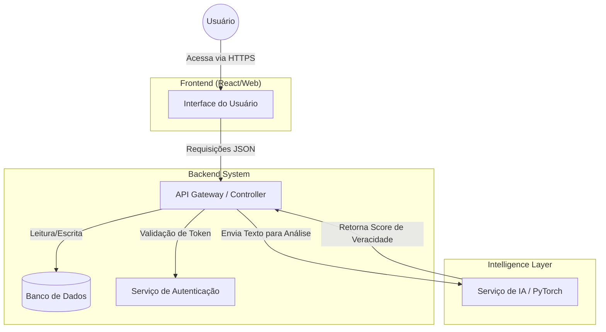

# 🤖 Project Argos: Plataforma de Detecção de Fake News


## 📖 Descrição Geral do Projeto

**Project Argos** é um sistema de informação desenvolvido como parte da disciplina de Engenharia de Software. O projeto tem como missão combater a desinformação através de uma plataforma inteligente capaz de analisar notícias e classificar seu potencial de veracidade. Utilizando técnicas de Inteligência Artificial e Processamento de Linguagem Natural, a ferramenta fornecerá aos usuários uma forma rápida e confiável de verificar conteúdos antes de compartilhá-los.

Este repositório contém todo o código-fonte, documentação e planejamento do projeto, aplicando práticas ágeis para garantir entregas de valor contínuas e de alta qualidade.

---

## 🎯 Objetivo Detalhado

O objetivo principal é desenvolver uma solução tecnológica robusta e acessível que auxilie na identificação de notícias falsas. Para isso, o projeto se baseia nos seguintes pilares:

- **Análise Inteligente:** Implementar e treinar modelos de Machine Learning para analisar textos, identificar padrões associados a fake news (como linguagem sensacionalista, fontes duvidosas e inconsistências) e fornecer um score de confiabilidade.
- **Interface Intuitiva:** Criar uma interface web limpa e de fácil utilização, onde qualquer usuário possa colar um link ou texto de uma notícia para análise imediata.
- **Base de Conhecimento:** Construir um backend escalável que gerencie as análises, armazene dados para retroalimentar os modelos e sirva uma API para o frontend.
- **Processo de Engenharia de Software:** Aplicar conceitos e práticas da engenharia de software, incluindo metodologias ágeis (Scrum/Kanban), controle de versão (Git), testes automatizados e integração contínua para garantir a qualidade e a manutenibilidade do sistema.


---

## 👥 Nossa Equipe

A equipe é composta por membros dedicados, cada um com um papel fundamental no ciclo de vida do projeto.

| Membro               | Papel                                    | GitHub                                                 |
| -------------------- | ---------------------------------------- | ------------------------------------------------------ |
| **Gabriel Monteiro** | 🤵 Product Owner (P.O.) & Security      | [Link para o perfil](https://github.com/decocampos)     |
| **Charlys Augusto**  | ⚙️ API & DB & Backend Developer         | [Link para o perfil](https://github.com/charlysfarias)  |
| **André Vinicius**   | 🛡️ Product Manager & DevOps             | [Link para o perfil](https://github.com/krosct)         |
| **João Victor**      | 🧪 Test & Framework Engineer            | [Link para o perfil](https://github.com/jvictornobre27) |
| **Luiz Carlos**      | 🎨 UI/UX & Frontend Developer           | [Link para o perfil](https://github.com/lcs8)           |

---

## 📋 Requisitos do Projeto

### Requisitos Funcionais (FR)

➡️ **[Acesse os Requisitos Funcionais (FRs.md)](./FRs.md)**

### Requisitos Não Funcionais (NFR)

➡️ **[Acesse os Requisitos Não Funcionais (NFRs.md)](./NFRs.md)**

---

## 📁 Estrutura do Projeto

O projeto está organizado em uma estrutura monorepo para facilitar o desenvolvimento e a integração entre as diferentes partes do sistema.

```
├── 📁 backend/
│    ├── src/
│    ├── tests/
│    └── ...
├── 📁 frontend/
│    ├── src/
│    │    ├── components/
│    │    ├── pages/
│    │    └── ...
│    └── ...
├── 📄 .gitignore
├── 📄 CONTRIBUTING.md
├── 📄 BUILD.md
├── 📄 README.md
└── ...
```

---

## 🚀 Guia de Build e Instalação Local

Para configurar o ambiente de desenvolvimento e executar o projeto localmente, siga as instruções detalhadas em nosso guia de build.

➡️ **[Acesse o Guia de Build (BUILD.md)](./BUILD.md)**

---

## ✨ Como Contribuir

Estamos abertos a contribuições! Se você deseja ajudar a melhorar o projeto, por favor, leia nosso guia de contribuição para entender nosso fluxo de trabalho e padrões de código.

➡️ **[Veja como contribuir (CONTRIBUTING.md)](./CONTRIBUTING.md)**

---

## 🎟️ Tarefas Iniciais (Issues)

Quer começar a contribuir? Temos algumas tarefas iniciais que são perfeitas para um primeiro contato com o projeto. Confira nossa página de Issues!

➡️ **[ISSUES](https://github.com/krosct/Project-ARGOS-ESS/issues/)**

---

## 🔗 Links Importantes

- **Quadro de Tarefas (Jira/Trello):** *[Link para o quadro do projeto](https://andre-vinicius-campos-lucena.atlassian.net/jira/software/projects/ARGOS/boards/2)*
- **Protótipo de Design (Miro):** *[[Link para o design no Miro](https://miro.com/welcomeonboard/R1JKYy9NOER5Rjd1MUlUcGFneWdqN0l5UFMzWk5kRGQ0SmUyNStiQ0pIek5FbTFVN1gwUkwwQlNVcnBUVFllNGFyMGYxeFRuRDdYNnBwaVhLY1QvVnRTSjRVb3JlQmRERThVbEJGTk1zd2hRNjJnMFZjNGdVWUhkcXJLekIrbFRNakdSWkpBejJWRjJhRnhhb1UwcS9BPT0hdjE=?share_link_id=453124489939)]*
- **Vídeo de Apresentação do Projeto:** *[Link para o vídeo](https://youtu.be/6UqLxnSNHLE)*
